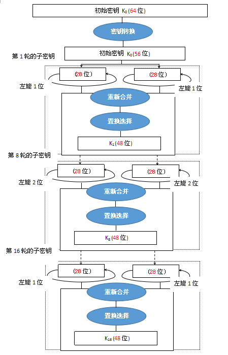
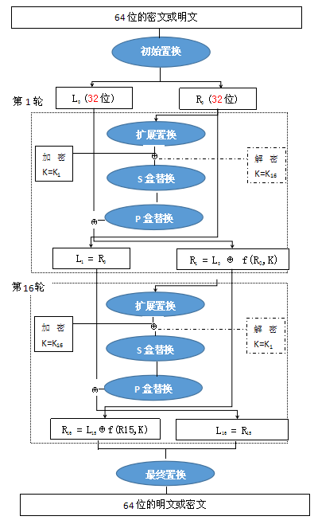
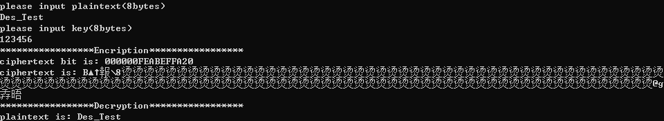

使用Matlab/C++实现DES加密算法

### 1算法简介

DES全称为Data Encryption Standard，即数据加密标准，是一种使用[密钥加密](https://baike.baidu.com/item/密钥加密/5928903)的块算法，1977年被[美国联邦政府](https://baike.baidu.com/item/美国联邦政府/8370227)的国家标准局确定为[联邦资料处理标准](https://baike.baidu.com/item/联邦资料处理标准/3940777)（FIPS），并授权在非密级政府通信中使用，随后该算法在国际上广泛流传开来。

### 2 算法原理

**DES是对称的，也就是说它使用同一个密钥来加密和解密数据。DES还是一种分组加密算法，该算法每次处理固定长度的数据段，称之为分组。DES分组的大小是64位，如果加密的数据长度不是64位的倍数，可以按照某种具体的规则来填充位。从本质上来说，DES的安全性依赖于虚假表象，从密码学的术语来讲就是依赖于“混乱和扩散”的原则。混乱的目的是为隐藏任何明文同密文、或者密钥之间的关系，而扩散的目的是使明文中的有效位和密钥一起组成尽可能多的密文。两者结合到一起就使得安全性变得相对较高。DES算法具体通过对明文进行一系列的排列和替换操作来将其加密。过程的关键就是从给定的初始密钥中得到16个子密钥的函数。要加密一组明文，每个子密钥按照顺序（1-16）以一系列的位操作施加于数据上，每个子密钥一次，一共重复16次。每一次迭代称之为一轮。要对密文进行解密可以采用同样的步骤，只是子密钥是按照逆向的顺序（16-1）对密文进行处理。**DES加密算法流程如下：

### 3 实验结果

